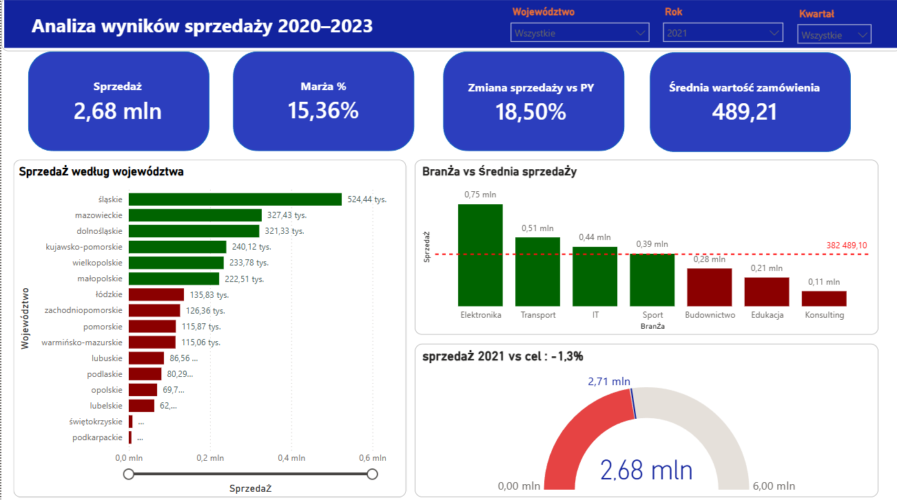
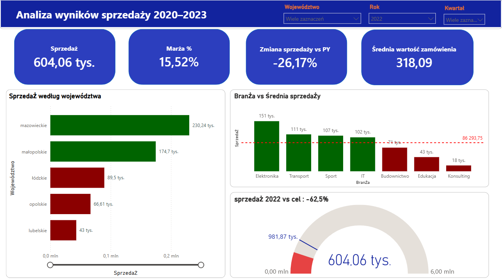
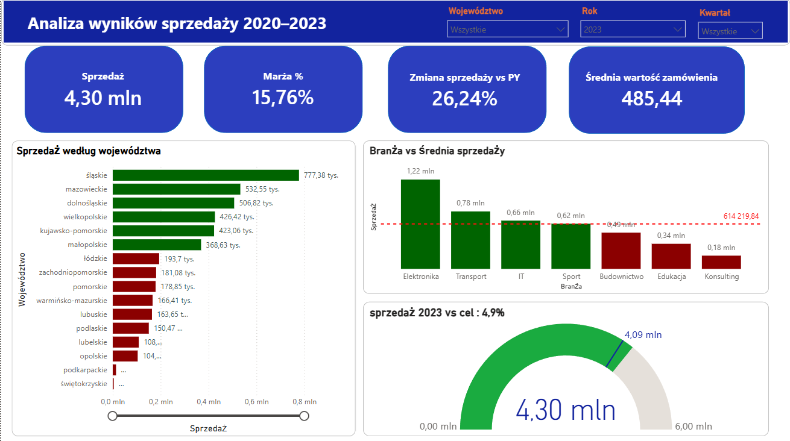

# Sales-Performance-Dashboard-Power-BI
Interactive Power BI dashboard for analyzing sales performance between 2020 and 2023

---

## Features

- Sales overview
- Profit margin analysis
- Year-over-Year (YoY) sales comparison
- Average order value
- Sales by region
- Industry performance vs average sales
- Target achievement gauge
- Interactive filters (Year, Quarter, Region)

---

## Technologies

- Power BI
- Power Query
- DAX
- Microsoft Excel

---

## Dashboard Preview

### 2021



### 2022



### 2023



---

## Project Structure

```
Sales-Performance-Dashboard-Power-BI
│
├── Data
│   └── Data.xlsx
│
├── Screenshots
│   ├── dashboard-2021.png
│   ├── dashboard-2022.png
│   └── dashboard-2023.png
│
├── Sales-Performance-Dashboard.pbix
│
└── README.md
```

---

## Files

- **Sales-Performance-Dashboard.pbix** – Power BI dashboard
- **Data/Data.xlsx** – source dataset

---

## Dashboard Highlights

- Interactive slicers
- KPI Cards
- Sales by Region
- Year-over-Year Analysis
- Industry Performance Comparison
- Sales Target Gauge
- Responsive Power BI layout
